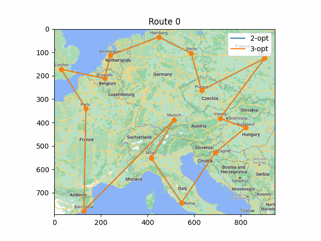

# Inserção do vizinho mais próximo

## Visualização do algoritmo opt-2

## Visualização do algoritmo opt-3

## Visualização da comparação entre os algoritmos opt-2 e opt-3

# Inserção da aresta mais barata

## Visualização do algoritmo opt-2

## Visualização do algoritmo opt-3

## Visualização da comparação entre os algoritmos opt-2 e opt-3

# Algoritmo de Clarke e Wright

## Visualização do algoritmo 2-opt

## Visualização do algoritmo 3-opt

## Visualização da comparação entre os algoritmos 2-opt e 3-opt

